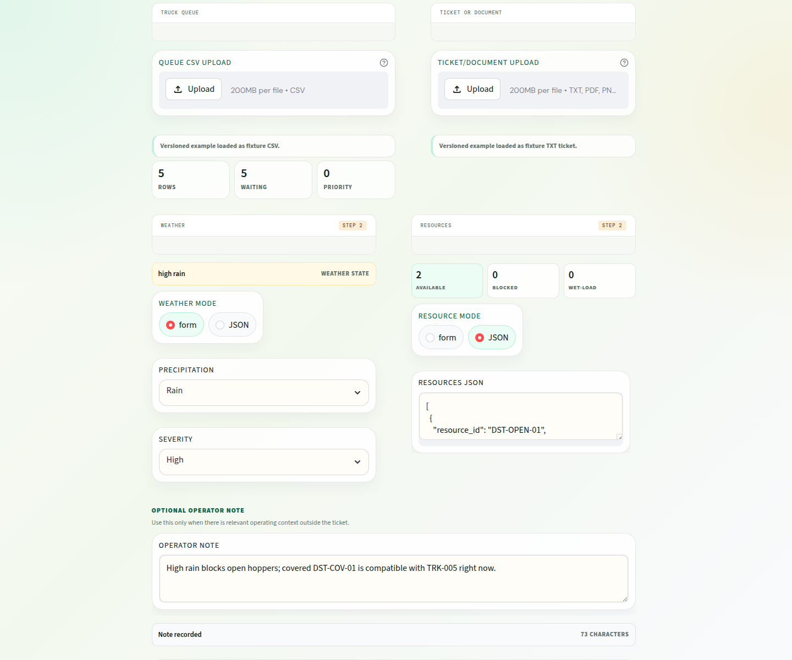
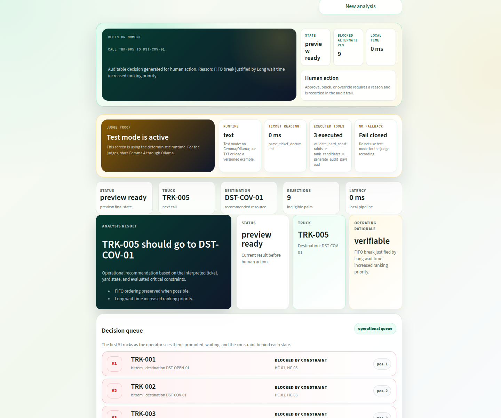
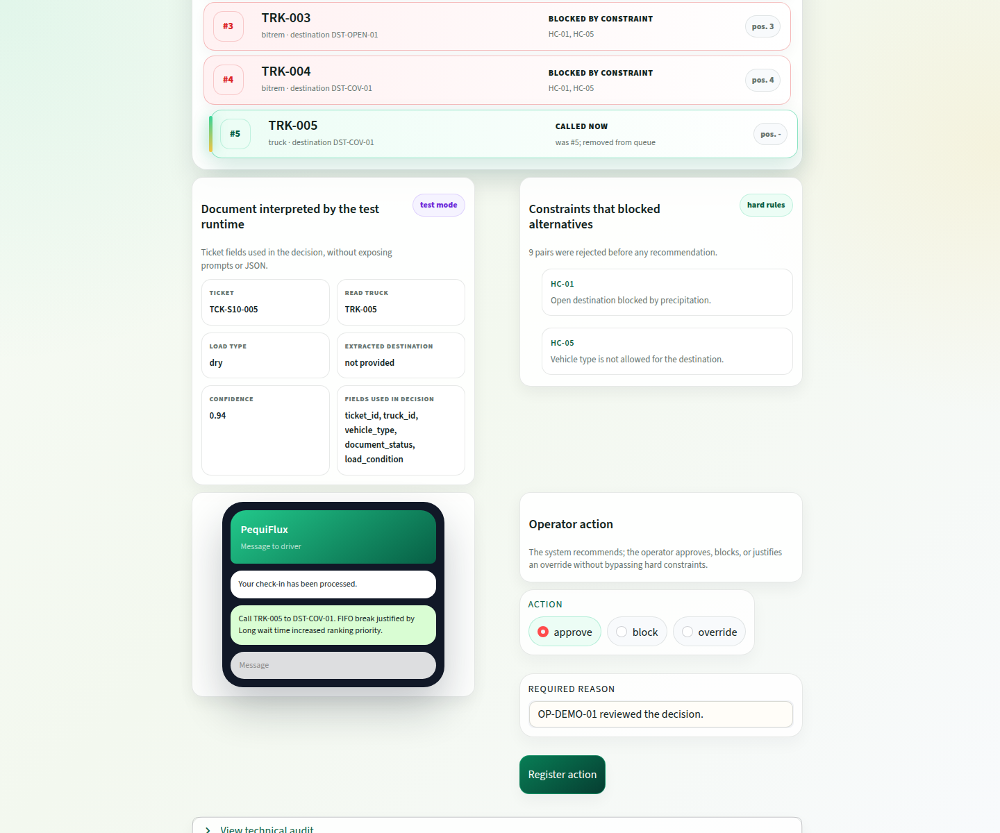
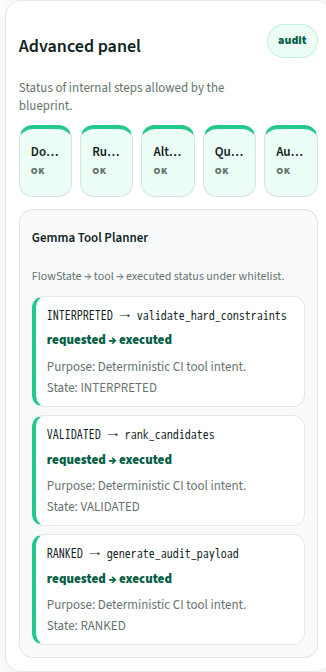

# PequiFlux Yard Copilot

[](https://github.com/PequiFlux/Pe-Q.I/actions/workflows/ci.yml)

Languages: [Português](README.md) | **English**

> A local-first, auditable, multimodal copilot for yard dispatch decisions.

PequiFlux Yard Copilot decides **which truck to call** and **which destination to dispatch it to** when pure FIFO is no longer enough. It is a **technical working proof of concept** - reproducible, auditable, and benchmarkable - built for the Gemma 4 Good Hackathon.

This repository should not be presented as production-ready software, field-validated operations, or a deployed operational integration. The data and scenarios are synthetic, and the point here is a serious, auditable, reproducible technical slice.

**Core principle:** Gemma interprets; deterministic rules decide; the human operator approves, blocks, or overrides; every step remains auditable.

## Hackathon Context

This repository is the **PequiFlux Yard Copilot** submission for the **Gemma 4 Good Hackathon**, a competition focused on real-world applications that use Gemma 4 to create measurable impact with a working demo, public code, a clear narrative, and technical evidence.

The project targets a concrete operational problem in logistics yards: during rain, document blocks, wet loads, unavailable resources, or contract priority conflicts, blindly following FIFO can call the wrong truck, send cargo to an incompatible destination, or require informal intervention with no audit trail. PequiFlux turns that exception moment into a verifiable decision.

Gemma 4 is used deliberately and audibly:

- it interprets ticket/document inputs in PDF, PNG, JPG, or TXT;
- it helps classify ambiguous exceptions when the document, operator note, and local state diverge;
- it acts as the **Gemma Tool Planner** in the `full` variant, choosing the next allowed tool for the workflow state;
- it never decides hard constraints, never mutates queue/resource/weather state, and never executes free-form commands.

The expected evaluator flow is simple: open the UI, load an example, analyze it with Gemma 4 or the reproducible text mode, see the recommended truck and destination, understand the operational reason, and inspect the technical audit trail.

The intended claim is deliberately narrow: this is a local-first technical proof with a synthetic benchmark, not industrial validation or production readiness.


Audit-ready decision: Pe-Q.I recommends the eligible truck, explains why FIFO would fail, and leaves final authority to the operator.

## UI Screenshots

The gallery is captured in English so the international README and submission assets use the same UI language. It follows the evaluator path end to end: prepare the case, load scenario S10, inspect the recommendation, review evidence, and open the technical audit. The runtime badge reflects the active capture mode; deterministic screenshots keep the README reproducible when local Gemma/Ollama is not available.

| Step | What to inspect | Screenshot |
|---|---|---|
| 1. Prepare a new decision | Empty operational workspace with language selector, example loader, queue input, ticket input, operator note, runtime selector, and required-input progress. |  |
| 2. Load S10 context | Scenario S10 loaded with rain set to high, resource state JSON visible, the covered destination available, and the operator note explaining why open hoppers are blocked. |  |
| 3. Inspect the recommendation | Audit-ready result: call `TRK-005` to `DST-COV-01`, show `PREVIEW_READY`, blocked alternatives, local latency, runtime proof, executed tools, and fail-closed status. |  |
| 4. Review evidence and human action | Evidence section with interpreted document fields, constraints that rejected alternatives, queue impact, driver-facing message, and approve/block/override controls. |  |
| 5. Open the tool audit | Technical audit panel showing allowed internal steps plus the Gemma Tool Planner path: requested and executed tools, flow state, purpose, and status. |  |

## For Evaluators

| In two minutes | Where to look |
|---|---|
| Thesis | Pe-Q.I recommends who to call, which hopper/destination to use, why pure FIFO would fail, and which rule supports the decision |
| Runnable demo | `make ui-text`/`make demo-text` without GPU; `make ui`/`make demo` for full Gemma/Ollama; `docker compose -f compose.yaml -f compose.gpu.yaml ...` for optional NVIDIA acceleration |
| Benchmark | `make bench` writes internal reports under `bench/reports/extended/<run_id>/`; [`bench/reports/sample/`](bench/reports/sample/) remains the frozen public snapshot |
| Visual evidence | [`assets/screenshots/`](assets/screenshots/) and the screenshots above |
| Demo explanation | [`docs/HACKATHON_OVERVIEW.md`](docs/HACKATHON_OVERVIEW.md) |
| Criteria and limits | [`docs/HACKATHON_SUBMISSION.md`](docs/HACKATHON_SUBMISSION.md) and [`docs/LIMITATIONS.md`](docs/LIMITATIONS.md) - Portuguese |

Main shortcuts:

```bash
make demo-text
make ui-text
make clean
make quality
make prepublish
make test
make bench
make audit
```

---

## Table of Contents

- [What It Is](#what-it-is)
- [Hackathon Context](#hackathon-context)
- [Quickstart](#quickstart)
- [Demo](#demo)
- [Text Runtime vs Gemma Runtime](#text-runtime-vs-gemma-runtime)
- [Benchmark](#benchmark)
- [Allowed Claims](#allowed-claims)
- [System Flow](#system-flow)
- [Hard Constraints](#hard-constraints)
- [Ranking Policy](#ranking-policy)
- [Fail-Closed Guarantee](#fail-closed-guarantee)
- [Decision Variants](#decision-variants)
- [Scenario Pack](#scenario-pack)
- [Configuration](#configuration)
- [Project Structure](#project-structure)
- [Tests](#tests)
- [Documentation](#documentation)
- [Submission Evidence](#submission-evidence)
- [Code Conventions](#code-conventions)
- [Repository Security](#repository-security)
- [License](#license)

---

## What It Is

A **vertical artifact with a clear boundary** that solves a narrow, judgeable problem:

> **Who should be called now, and to which destination, when an operational exception breaks the legitimacy of pure FIFO.**

The copilot receives five inputs - queue CSV, ticket/document, operator note, weather state, and resource state - and produces:

| Output | Description |
|-------|-------------|
| Recommended truck-destination pair | Or explicit `BLOCKED` / `REVIEW_REQUIRED` state |
| Fired hard constraints | Which rules eliminated ineligible pairs |
| Auditable justification | Full provenance and input hashes |
| Driver message | 220 characters or fewer |
| Available human action | `approve`, `block`, or `override` with a reason |

What Gemma 4 proves in this submission - three places where a heuristic baseline performs poorly:

1. **Multimodal ticket/document parsing** - extracts structured fields from PDF/image inputs with confidence.
2. **Exception classification** - reconciles document, note, and state when they disagree.
3. **Controlled tools** - in the `full` flow, constraints, ranking, and audit are executed through a whitelist, state order, and structured logs.

`reason_summary` is generated deterministically from the formal decision; Gemma interprets documents and helps with ambiguous classification. In the `full` flow, Gemma acts as a Tool Planner: it selects the next tool from those available for the `FlowState`, and the `ToolGateway` executes `validate_hard_constraints`, `rank_candidates`, and `generate_audit_payload` under whitelist, schema, state order, local ID validation, and structured logging.

---

## Quickstart

### Prerequisites

- Docker and Docker Compose
- NVIDIA Container Toolkit for GPU execution

### Build and Run the Minimal Scenario

```bash
docker build -t pequiflux-yard-copilot:local .
docker run --rm pequiflux-yard-copilot:local
```

This path uses `PEQUIFLUX_GEMMA_RUNTIME=text` inside the image and does not require GPU, Ollama, or the `gemma` service.

Shortcut:

```bash
make demo-text
```

This runs scenario **S10_FIFO_BREAK_JUSTIFIED** with the deterministic text runtime.

### Test Suite

```bash
docker build --target test -t pequiflux-yard-copilot:test .
docker run --rm pequiflux-yard-copilot:test
```

Shortcut:

```bash
make test
```

The `test` target uses `PEQUIFLUX_GEMMA_RUNTIME=text`; it does not require GPU or Ollama.

### Streamlit UI

```bash
docker compose --profile ui-text up ui-text
```

Shortcut:

```bash
make ui-text
```

Open [http://localhost:8501](http://localhost:8501).

For the full UI with Ollama/Gemma, run `make ui`; Compose starts `gemma`, runs `gemma-init` to pull `${GEMMA_MODEL:-gemma4:e2b}`, and then starts the UI.

### Full Benchmark with Gemma/Ollama

```bash
docker compose run --rm benchmark
```

Shortcut:

```bash
make bench
```

Reports are written to `bench/reports/extended/` by default. The frozen public snapshot remains in `bench/reports/sample/`.

### Local Checklist Only When Docker Is Unavailable

```bash
PEQUIFLUX_GEMMA_RUNTIME=text pytest -q
```

---

## Demo

The default demo, scenario S10, demonstrates the core project argument: **breaking FIFO is justified by operational constraints**.

```bash
# Minimal reproducible path, no GPU/Ollama
docker compose run --rm demo-text

# Specific scenario
SCENARIO=S02_RAIN_OPEN make demo-text

# Full mode with Gemma/Ollama
docker compose run --rm demo
```

Expected output shape:

```json
{
  "request_id": "REQ-2026-0010",
  "scenario_id": "S10_FIFO_BREAK_JUSTIFIED",
  "variant": "full",
  "decision_status": "PREVIEW_READY",
  "recommended_truck": { "truck_id": "TRK-005", "queue_position_before": 5 },
  "recommended_destination": { "destination_id": "DST-COV-01" },
  "reason_summary": "FIFO break justified by Long wait time increased ranking priority.",
  "fired_rules": ["PR-01", "PR-04"],
  "rejected_count": 9,
  "hard_constraints_checked": ["HC-01", "HC-05"],
  "latency_ms": {
    "parse_ticket_document": 0,
    "validate_hard_constraints": 0,
    "rank_candidates": 0
  }
}
```

`fired_rules` lists only policy/ranking rules (`PR-*`). Hard constraints (`HC-*`) appear in `hard_constraints_checked` and in rejected candidates in the validation matrix.

---

## Text Runtime vs Gemma Runtime

The system provides two interpretation runtimes, selected through `PEQUIFLUX_GEMMA_RUNTIME`.

### Gemma Runtime (`ollama`)

| Aspect | Detail |
|--------|--------|
| Backend | Local Ollama hosting Gemma 4; E4B recommended, E2B as a model fail-closed option |
| Parsing | Real multimodal parsing: PDF rendered to image plus extracted text |
| Exception classification | The model interprets document, note, and state |
| `reason_summary` | Generated deterministically from the formal decision |
| Gemma Tool Planner + ToolGateway | In the `full` flow, Gemma chooses the next legal tool for the `FlowState`; the gateway executes `validate_hard_constraints`, `rank_candidates`, and `generate_audit_payload` under whitelist, state order, local ID validation, and structured logging |
| Temperature | `0` |
| Output format | Structured JSON validated against Pydantic schemas |
| Requirements | GPU or acceptable CPU latency; active Ollama; model already pulled |

### Text Runtime (`text`)

| Aspect | Detail |
|--------|--------|
| Backend | Pure deterministic parser: no model, no GPU, no network |
| Parsing | Simple regex over `ticket.txt`; multimodal CI fixtures use an `expected_ticket.json` sidecar |
| Exception classification | Returns `MANUAL_REVIEW_HINT` with `needs_human_review=true` |
| `reason_summary` | Generated deterministically from the formal decision |
| ToolGateway | Deterministic intent for CI; no real Gemma/Ollama |
| Output format | `ParsedTicket` validated normally with Pydantic |
| Requirements | None; works in CI, Docker without GPU, and any machine |
| Main use | Tests, CI/CD, contract validation, quick debugging |

### Which Runtime to Use

| Situation | Recommended runtime |
|----------|---------------------|
| Judge demo / video | `ollama` |
| CI/CD and automated tests | `text` |
| Local development without GPU | `text` |
| Full comparative benchmark | `ollama` for the `full` variant |
| Deterministic rule validation | `text` with the `heuristic` variant |

### Disable Gemma Completely

```bash
PEQUIFLUX_GEMMA_RUNTIME=none
```

The adapter returns `None`, and the orchestrator fails closed with `MODEL_RUNTIME_UNAVAILABLE`; it never falls back.

---

## Benchmark

The benchmark runs the current versioned pack (**20 scenarios x 4 comparative rows**) and computes comparative metrics. The operational `fifo` variant still exists internally, but the report names it `fifo_safe` because it still passes through hard constraints.

There are three conceptually distinct report locations:

- `bench/reports/sample/`: frozen public snapshot with 20 scenarios for README, CI, and submission evidence.
- `bench/reports/extended/<run_id>/`: internal development runs that can grow without inflating the public page.
- `bench/reports/extended-sample/<run_id>/`: temporary snapshots for testing changes near the public sample without changing the frozen evidence.

### Variants

| Variant | Gemma? | Behavior |
|---------|--------|----------|
| `full` | Yes (Ollama) | Multimodal parsing, exception classification, and Gemma Tool Planner under `ToolGateway`; `reason_summary` is deterministic |
| `heuristic` | No | Same deterministic rules engine; structured text parser; template explanation |
| `fifo_safe` | No | FIFO among eligible pairs; ignores document interpretation but respects hard constraints |
| `raw_fifo` | No | Raw FIFO by `arrival_ts` and `declared_destination`; ignores context and constraints |

### Metrics

| Metric | What it measures | Target |
|--------|------------------|--------|
| `constraint_violation_rate` | Hard-constraint violation | **0** |
| `decision_match_at_1` | Top-1 agreement with the expected decision | > baseline |
| `exception_f1` | Macro-F1 for exception classification | > baseline |
| `ticket_field_accuracy` | Field-level accuracy for parsed tickets | > baseline |
| `fifo_break_justified_precision` | Precision of justified FIFO breaks | > baseline |
| `latency_p50` / `latency_p95` | Decision latency in ms with local Ollama/Gemma | p50 <= 8s, p95 <= 15s on reference hardware |
| `audit_completeness` | Audit-trail completeness | 100% |

`audit_completeness` measures completeness of payloads that enter the comparative benchmark. It is not a universal indicator for every catastrophic failure. For pre-ingestion failures, such as a missing file before interpretation exists, full hashes, latency, and provenance may not exist; in those cases the correct expectation is to fail closed with an explicit error, not to preserve `audit_completeness = 1.0`.

`summary.csv` also exports Gemma Tool Planner evidence columns: `tool_call_count`, `tool_call_success`, `tool_path`, `tool_error_count`, and `planner_step_count`. `metrics.json` aggregates this trail per variant with `tool_call_success_rate`, `avg_tool_call_count`, `avg_planner_step_count`, `tool_error_count`, and `tool_error_rate`. In the `full` variant, they show the auditable path of tools requested by Gemma and executed under `ToolGateway`; in `raw_fifo`, `fifo_safe`, and `heuristic`, they remain zero.

### Success Criteria

- `constraint_violation_rate = 0` in the full system
- Improvement over the heuristic baseline in `ticket_field_accuracy`, `exception_f1`, and `decision_match_at_1`
- The versioned sample must include at least one multimodal case where `heuristic` fails closed or loses accuracy and `full` reaches the expected result
- 100% of FIFO breaks and overrides have a reconstructable trail
- all versioned scenarios run without manual editing

### Execution

```bash
docker compose run --rm benchmark
```

Default output: `bench/reports/extended/<run_id>/` with `metrics.json`, `per_scenario.json`, and `summary.csv`.

### Frozen Public Snapshot

The versioned snapshot in `bench/reports/sample/` is frozen at 20 scenarios. It includes `S03_WET_LOAD` and `S11_IMAGE_ROTATED_WET_LOAD` as `image/png` tickets, plus `S12_PDF_SCANNED_DOCUMENT_BLOCK` as a scanned PDF with no extractable text.

It is generated with deterministic text runtime/fixtures for CI and measures contracts, behavior, accuracy, and separation between variants. Zero latencies in this sample do not represent real performance; latency should only be read from local Ollama/Gemma runs in the `extended` path.

The CLI refuses `bench/reports/sample/` as `--output-dir`; new tests should use `bench/reports/extended-sample/<run_id>` or a local temporary directory.

- `full`: `20/20`, `decision_match_at_1 = 1.0`, `exception_f1 = 1.0`, `ticket_field_accuracy = 0.969`, `audit_completeness = 1.0`, `tool_call_success_rate = 0.95`, `avg_tool_call_count = 4.7`, `avg_planner_step_count = 2.35`, `tool_error_rate = 0.05`
- `heuristic`: `decision_match_at_1 = 0.85`, `exception_f1 = 0.678`, `ticket_field_accuracy = 0.85`, `audit_completeness = 0.85`
- `fifo_safe`: `decision_match_at_1 = 0.75`, `constraint_violation_rate = 0.0`
- `raw_fifo`: `decision_match_at_1 = 0.25`, `constraint_violation_rate = 0.35`
- `S03_WET_LOAD`, `S11_IMAGE_ROTATED_WET_LOAD`, and `S12_PDF_SCANNED_DOCUMENT_BLOCK`: `heuristic` closes as `BLOCKED` due to missing extractable text; `full` reaches the expected result through the multimodal CI sidecar.

### Internal Extended Benchmark

Use the `extended` path to evolve the scenario pack, real latency, ablations, and larger comparisons without changing the public sample contract. Use `extended-sample` only when comparing a test snapshot against the frozen public evidence.

```bash
make bench
```

To force a specific destination:

```bash
docker compose run --rm benchmark python -m app.cli.run_benchmark --manifest scenarios/manifest.json --output-dir bench/reports/extended/manual-run
```

### Clean Evaluation Without Expected-Ticket Leakage

Text-runtime B0 may use `expected_ticket.json` as a contract fixture for multimodal cases. Clean evaluation splits (`public_dev`, `public_test_frozen`, `private_holdout`) must not contain that sidecar for PDF/PNG/JPG tickets, because it would contaminate multimodal parsing metrics.

Run the guard before clean benchmarking:

```bash
python -m bench.clean_eval \
  --variant full \
  --runtime gemma4:e4b \
  --scenario-dir scenarios/extended/public_test_frozen \
  --output artifacts/latest/clean_public_test \
  --fail-on-leakage
```

To turn a run into submission artifacts, use the statistics and reporting modules. The real benchmark `metrics.json` is accepted directly; `bench.reporting` normalizes the `full` variant, evaluates gates, and writes `metrics.json`, `summary.csv`, `error_analysis.csv`, and `report.md`.

```bash
python -m bench.stats \
  --baseline artifacts/latest/heuristic_public_test/metrics.json \
  --candidate artifacts/latest/clean_public_test/metrics.json \
  --output artifacts/latest/stats_report.json

python -m bench.reporting \
  --metrics artifacts/latest/clean_public_test/metrics.json \
  --stats artifacts/latest/stats_report.json \
  --errors artifacts/latest/clean_public_test/error_analysis.csv \
  --output artifacts/latest
```

The `.github/workflows/eval.yml` workflow mirrors this contract: on PRs it runs the cheap text evaluation and uploads artifacts; on manual or scheduled runs it executes the clean `gemma4:e4b` benchmark, uploads `artifacts/latest`, and fails when `submission_ready` is false. For an external runner, set `GEMMA_BASE_URL` in repository secrets.

Artifacts can be inspected in the Streamlit `Benchmark dashboard` page from `app/ui/pages/benchmark_dashboard.py` and in the minimal notebooks:

- `notebooks/01_baselines.ipynb`
- `notebooks/02_multimodal_parsing_eval.ipynb`
- `notebooks/03_robustness.ipynb`

Test shortcut:

```bash
make leakage-guard
```

### Gemma Setup

Gemma setup is required for `make demo` and benchmarks with the Ollama runtime; `make ui` performs it automatically.

```bash
# Pull the model into the Ollama volume
docker compose --profile gemma-setup run gemma-init

# Warm up the model with the first inference
docker compose --profile gemma-setup run gemma-prewarm
```

---

## Allowed Claims

These are the only claims allowed for this submission:

| Allowed claim | Evidence |
|---------------|----------|
| "The system is reproducible, auditable, and benchmarkable" | Single Docker commands; public snapshot in `bench/reports/sample/` and internal runs in `bench/reports/extended/`; immutable SQLite/JSONL trail |
| "Gemma adds value over the heuristic baseline" | Comparative benchmark with `ticket_field_accuracy`, `exception_f1`, and `decision_match_at_1` |
| "No hard constraint is violated" | `constraint_violation_rate = 0` enforced by unit tests, failure tests, and benchmark |
| "The system fails closed" | `app.gemma.fallback.forbid_fallback()` always raises `FallbackForbiddenError`; tests in `tests/unit/test_no_fallbacks.py` |
| "The human operator is the final authority" | `approve`/`block`/`override` actions with an audit trail; invalid override returns `REVIEW_REQUIRED` |
| "Every FIFO break has an auditable trail" | `audit_completeness = 100%` is a success criterion |
| "Operation is local-first after setup/cache" | Docker Compose; no cloud dependency after model pull |

### Claims That Are Not Allowed

| Forbidden claim | Why |
|-----------------|-----|
| "Field validated" | Data and scenarios are synthetic |
| "Production ready" | No real operational validation |
| "Optimizes the whole yard globally" | Scope is point dispatch under exception |
| "Fine-tuned for real operations" | Model is used zero-shot with contract-first prompting |
| "Replaces the operator" | The human approves, blocks, or overrides; the system recommends |
| "X% accuracy" as an absolute value | Thresholds and weights are deliberately generic under Assumption A-09 |

---

## System Flow

```text
queue.csv + ticket + note + weather + resources
    |
    v
[ Adapters ]         -- normalize raw inputs into canonical objects
    |
    v
[ Gemma ]            -- multimodal parsing and ambiguous exception classification
    |
    v
[ Truth Resolver ]   -- local state > parsed document > note; conflicts = BLOCKED
    |
    v
[ Hard Constraints ] -- HC-01 to HC-07; any failure = ineligible pair
    |
    v
[ Ranking ]          -- weighted scoring over eligible pairs only
    |
    v
[ Decision Builder ] -- preview, driver message, audit payload
    |
    v
[ UI ]               -- operator sees the recommendation, validates, and finalizes
```

In the `full` variant, `validate_hard_constraints`, `rank_candidates`, and `generate_audit_payload` are requested by the Gemma Tool Planner and executed by the `ToolGateway`; in `fifo_safe`/`heuristic`, those steps are called directly by the orchestrator.

### State Machine

```text
RECEIVED -> NORMALIZED -> PARSED -> INTERPRETED -> VALIDATED -> RANKED -> PREVIEW_READY -> HUMAN_FINALIZED
    |          |            |           |             |           |            |
    +--------> BLOCKED <----+-----------+-------------+-----------+            |
    +--------> REVIEW_REQUIRED <-------+-------------+-----------+            |
    +--------> ERROR_TERMINAL <--------+-------------+                        |
                                                               (approve / block / override)
```

- **BLOCKED**: There is enough evidence that no safe automatic dispatch exists.
- **REVIEW_REQUIRED**: Truth is insufficient for automation; a human must intervene.
- **ERROR_TERMINAL**: System failure only. Never a silent fallback.

---

## Hard Constraints

| ID | Name | Rule |
|----|------|------|
| HC-01 | `OPEN_DESTINATION_BLOCKED_BY_RAIN` | Rain plus open exposure makes the pair ineligible |
| HC-02 | `WET_LOAD_REQUIRES_COMPATIBLE_DESTINATION` | Wet load requires a compatible destination |
| HC-03 | `DOWN_OR_BLOCKED_RESOURCE_CANNOT_RECEIVE` | Down/blocked resource cannot receive dispatch |
| HC-04 | `DOCUMENT_BLOCK_PREVENTS_DISPATCH` | Non-clear document makes auto-dispatch ineligible |
| HC-05 | `VEHICLE_DESTINATION_COMPATIBILITY` | Vehicle type must be allowed by the destination |
| HC-06 | `MIN_OPERATIONAL_CAPACITY_REQUIRED` | Below minimum is ineligible; between minimum and comfort is penalized |
| HC-07 | `OVERRIDE_CANNOT_BYPASS_HARD_CONSTRAINTS` | Override requires a reason and only accepts eligible pairs |

Violation rate must be **zero** across all scenarios.

---

## Ranking Policy

Default profile: `v1-demo`.

| Weight | Value | Rule | Meaning |
|--------|-------|------|---------|
| FIFO position | 40 | PR-01 | Arrival order is preserved when possible |
| Contract priority | 30 | PR-02 | Contracted truck beats FIFO among eligible pairs |
| Resource fit | 15 | PR-06 | Destination aligned with active exception receives an auditable bonus |
| Capacity headroom | 10 | PR-03 | Reduced capacity is penalized |
| Wait SLA pressure | 5 | PR-04 | Excessive wait receives a bounded bonus |
| No valid pair | - | PR-05 | No valid pair returns `BLOCKED`, not improvisation |

Tie-break: higher score, lower queue position, earlier arrival, lexicographic ID.

Only **eligible** pairs, meaning pairs that passed all hard constraints, enter ranking.

---

## Fail-Closed Guarantee

The system **never falls back**:

- No substitute model, degraded heuristic, or silent mode.
- No retry that changes decision logic.
- No automatic substitution for missing dependencies.
- `app.gemma.fallback.forbid_fallback()` always raises `FallbackForbiddenError`.
- `tests/unit/test_no_fallbacks.py` enforces this at test level.
- Blueprint audit (`app.cli.blueprint_audit`) scans for deprecated fallback wording.

If truth is insufficient, the decision is `BLOCKED` or `REVIEW_REQUIRED` with an explicit reason.

---

## Decision Variants

| Variant | Gemma? | Behavior |
|---------|--------|----------|
| `full` | Yes (Ollama) | Multimodal parsing, exception classification, and Gemma Tool Planner under `ToolGateway`; `reason_summary` is deterministic |
| `heuristic` | No | Deterministic rules engine; text parser; explanation templates |
| `fifo` | No | Safe operational FIFO: preserves queue order among eligible pairs and still respects hard constraints |

In benchmark reports, this variant appears as `fifo_safe`. The `raw_fifo` row is computed separately from the raw queue to keep the public pure-FIFO comparison outside the main operational screen.

Selection through `PEQUIFLUX_GEMMA_RUNTIME`:

| Value | Effect |
|-------|--------|
| `ollama` | Local Ollama with Gemma 4 |
| `text` | Deterministic parser for CI/tests |
| `none` / `disabled` | No Gemma runtime; fail closed |

---

## Scenario Pack

The main pack has 20 synthetic scenarios in `scenarios/cases/` and is frozen as the public showcase. Future cases should go to `scenarios/extended/stress/` or `scenarios/extended/failure/`, not the main manifest.

Canonical human catalog:

- [`scenarios/README.md`](scenarios/README.md)

Structural contract and integrity criteria:

- [`docs/scenario-pack.md`](docs/scenario-pack.md)

For quick reading on the public page, the main groups are:

- Operational baseline and main narrative: `S01`-`S10`, especially `S10_FIFO_BREAK_JUSTIFIED`
- Multimodal robustness: `S03`, `S11`, `S12`
- Truth conflicts and fail-closed behavior: `S13`-`S16`
- Governance, tie-breaks, and stress: `S17`-`S20`

---

## Configuration

All configuration is done through Docker Compose environment variables or explicit runtime inputs. **No `.env` file is committed.**

Secret-free example: [`config/env.example`](config/env.example). The repository avoids `.env.example` at the root because local policy blocks any `.env.*` in the top-level directory.

| Variable | Default | Purpose |
|----------|---------|---------|
| `PEQUIFLUX_GEMMA_RUNTIME` | `ollama` in code; `text` in the standalone Docker image | Gemma backend: `ollama`, `text`, or `none` |
| `GEMMA_BASE_URL` | `http://gemma:11434` | Ollama API endpoint |
| `GEMMA_MODEL` | `gemma4:e2b` | Default Gemma 4 model identifier in Ollama; switch to `gemma4:e4b` if the hardware supports it |
| `GEMMA_TIMEOUT_SECONDS` | `45` | Timeout for Gemma calls |
| `OLLAMA_IMAGE` | `ollama/ollama:latest` | Ollama Docker image; GPU variant for acceleration |
| `OLLAMA_KEEP_ALIVE` | `24h` | Model keep-alive in Ollama |
| `PEQUIFLUX_IN_CONTAINER` | `0` | Set to `1` by the Dockerfile |
| `PEQUIFLUX_SQLITE_PATH` | `var/db/pequiflux_ui.db` | SQLite database path |

`make demo-text` and `make ui-text` do not start the `gemma` service and do not require GPU. For full mode, set `OLLAMA_IMAGE` to the desired variant and install the NVIDIA Container Toolkit if using GPU.

---

## Project Structure

```text
.
├── app/                      # Runtime source code
│   ├── adapters/             # CSV, document, note, and state ingestion
│   ├── audit/                # Auditable payload construction
│   ├── cli/                  # CLI entrypoints: run_scenario, run_benchmark, prewarm_gemma
│   ├── domain/               # Models, enums, constraints, ranking, policy
│   ├── gemma/                # Adapter, prompts, schemas, tool gateway, runtime factory
│   ├── orchestration/        # Orchestrator, state machine, truth resolver
│   ├── services/             # Parsing, exception classification, decision builder, driver message
│   ├── storage/              # SQLite store, JSONL logger
│   └── ui/                   # Streamlit application
├── bench/                    # Benchmark runner and metrics
├── data/                     # Runtime data directory
├── docs/                     # Modular documentation
├── scenarios/                # Synthetic benchmark fixtures
│   ├── cases/                # S01-S20 directories for the frozen public showcase
│   ├── common/               # Policy profile and destination catalog
│   ├── extended/             # Future cases outside the main sample
│   ├── manifest.json         # Full scenario-pack payloads
│   └── schemas/              # JSON schemas for contracts
├── scripts/                  # Shell scripts: bootstrap, demo, benchmark, prepublish
├── tests/                    # Test suite
│   ├── unit/                 # Deterministic unit tests
│   ├── contract/             # API/payload contract tests
│   ├── golden/               # Golden output tests
│   ├── integration/          # Cross-module integration tests
│   ├── scenarios/            # Scenario-pack E2E validation
│   ├── e2e/                  # Complete end-to-end tests
│   └── failure/              # Fail-closed path tests
├── technical_blueprint.md    # Canonical technical blueprint, 3,100+ lines
├── compose.yaml              # Docker Compose services and profiles
├── Dockerfile                # Multi-stage build: wheels -> runtime -> test -> ui
├── pyproject.toml            # Project metadata and pytest configuration
├── requirements.txt          # Core: pydantic, PyMuPDF
├── requirements-dev.txt      # Dev: plus pytest
├── requirements-ui.txt       # UI: plus streamlit
├── requirements-all.txt      # All dependencies
└── AGENTS.md                 # Repository guidelines for AI agents
```

---

## Tests

```bash
# Full suite through Docker
docker build --target test -t pequiflux-yard-copilot:test .
docker run --rm pequiflux-yard-copilot:test

# Quick local check only when Docker is unavailable
PEQUIFLUX_GEMMA_RUNTIME=text pytest -q
```

| Directory | Purpose |
|-----------|---------|
| `tests/unit/` | Deterministic unit tests by module |
| `tests/contract/` | API and payload contracts |
| `tests/golden/` | Golden output comparison |
| `tests/integration/` | Cross-module integration |
| `tests/scenarios/` | Scenario-pack E2E validation |
| `tests/e2e/` | Complete end-to-end flow |
| `tests/failure/` | Failure paths; the system must stop or return an explicit state |

Every hard constraint has at least one deterministic test. Failure tests confirm that the system stops or returns `REVIEW_REQUIRED`/`BLOCKED`; it never falls back.

---

## Documentation

The `docs/` directory contains modular implementation documentation. In case of technical conflict, the root `technical_blueprint.md` is canonical; modular docs describe the current implementation.

| Document | Contents |
|----------|----------|
| [`README.md`](README.md) | Portuguese public README |
| [`README.en.md`](README.en.md) | English public README |
| [`docs/product.md`](docs/product.md) | Thesis, problem, scope, success criteria |
| [`docs/decision-policy.md`](docs/decision-policy.md) | Constraints, ranking, truth, decision semantics |
| [`docs/architecture.md`](docs/architecture.md) | Modules, flow, state machine, persistence |
| [`docs/gemma.md`](docs/gemma.md) | Gemma role, contract-first prompting, ToolGateway |
| [`docs/contracts.md`](docs/contracts.md) | Payloads and function contracts |
| [`docs/scenario-pack.md`](docs/scenario-pack.md) | Scenario structure, benchmark, reports |
| [`docs/docker.md`](docs/docker.md) | Docker/Compose use, variables, GPU |
| [`docs/public-repo.md`](docs/public-repo.md) | Sanitization and publication checklist |
| [`docs/HACKATHON_OVERVIEW.md`](docs/HACKATHON_OVERVIEW.md) | Demo explanation, hackathon claim, and main evidence |
| [`docs/HACKATHON_SUBMISSION.md`](docs/HACKATHON_SUBMISSION.md) | Hackathon criteria mapped to repo evidence, in Portuguese |
| [`docs/LIMITATIONS.md`](docs/LIMITATIONS.md) | Explicit prototype limits, in Portuguese |
| [`docs/UI_DECISIONS.md`](docs/UI_DECISIONS.md) | Interface decisions for operator, FIFO, and audit |
| [`docs/CODEMAP.md`](docs/CODEMAP.md) | Live module map |
| [`docs/SURFACE_MAP.md`](docs/SURFACE_MAP.md) | Public/exported contracts |
| [`docs/DUPLICATION_GUARD.md`](docs/DUPLICATION_GUARD.md) | Reuse points and anti-duplication guard |
| [`docs/SETUP_STATUS.md`](docs/SETUP_STATUS.md) | Setup state, checks, and available commands |
| [`technical_blueprint.md`](technical_blueprint.md) | Canonical technical blueprint |
| [`docs/technical_blueprint.md`](docs/technical_blueprint.md) | Short pointer to the root canonical source |

---

## Submission Evidence

| Evidence | Path |
|---|---|
| Final interface screenshot | [`assets/screenshots/pequiflux-ui.png`](assets/screenshots/pequiflux-ui.png) |
| UI visual flow | [`assets/screenshots/pequiflux-ui-01-initial.png`](assets/screenshots/pequiflux-ui-01-initial.png), [`assets/screenshots/pequiflux-ui-02-inputs-loaded.png`](assets/screenshots/pequiflux-ui-02-inputs-loaded.png), [`assets/screenshots/pequiflux-ui-03-decision-result.png`](assets/screenshots/pequiflux-ui-03-decision-result.png), [`assets/screenshots/pequiflux-ui-04-evidence-and-operator.png`](assets/screenshots/pequiflux-ui-04-evidence-and-operator.png), [`assets/screenshots/pequiflux-ui-05-tool-audit.png`](assets/screenshots/pequiflux-ui-05-tool-audit.png) |
| Benchmark sample report | [`bench/reports/sample/`](bench/reports/sample/) |
| Internal extended reports | `bench/reports/extended/<run_id>/` |
| Preferred judge video | [`artifacts/judge-demo/pequiflux-gemma-proof-fluid.webm`](artifacts/judge-demo/pequiflux-gemma-proof-fluid.webm) |
| Demo explanation | [`docs/HACKATHON_OVERVIEW.md`](docs/HACKATHON_OVERVIEW.md) |
| Submission map | [`docs/HACKATHON_SUBMISSION.md`](docs/HACKATHON_SUBMISSION.md) - Portuguese |

---

## Code Conventions

- **Python 3.11**, type-annotated, 4-space indentation.
- Functions: `snake_case`; classes/Pydantic models: `PascalCase`; constants: `UPPER_SNAKE_CASE`.
- Rule IDs exactly as in the blueprint, for example `HC_01_OPEN_DESTINATION_BLOCKED_BY_RAIN`.
- Formatting: `black`; import sorting: `isort`.
- Commits: [Conventional Commits](https://www.conventionalcommits.org/) such as `feat:`, `fix:`, `docs:`, `test:`.

---

## Repository Security

- **All data is synthetic.** No real customer data, credentials, or operator identifiers.
- Placeholder IDs only, for example `OP-DEMO-01`.
- Thresholds, weights, and scenarios are aligned with sanitized blueprint assumptions.
- No `.env`, `.env.*`, or `.venv/` in the repository.
- Configuration through Docker, Compose, documented placeholders, or explicit runtime inputs; never committed secrets.
- `scripts/prepublish_check.sh` verifies these restrictions before release.

---

## License

MIT. See [`LICENSE`](LICENSE).
