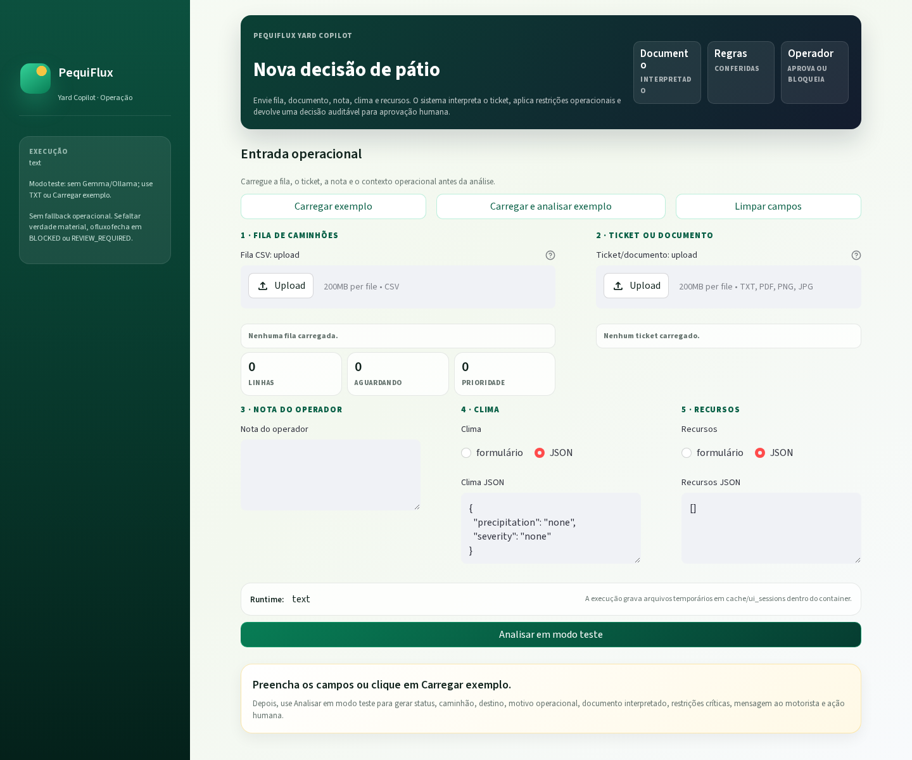
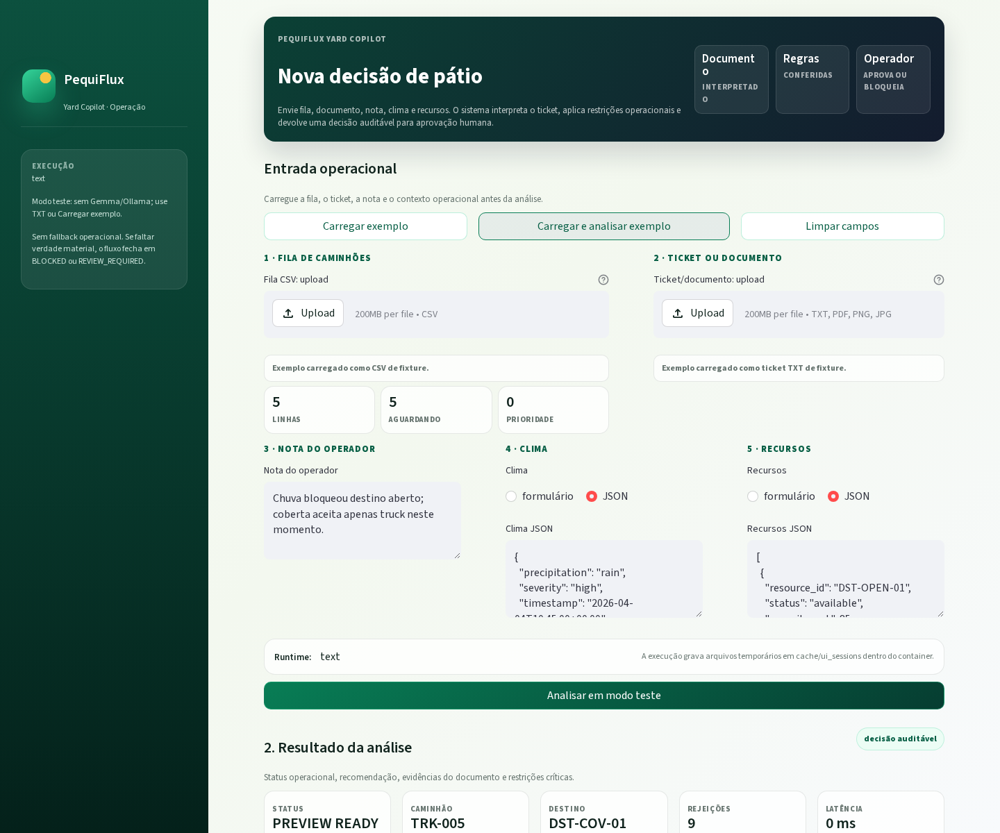
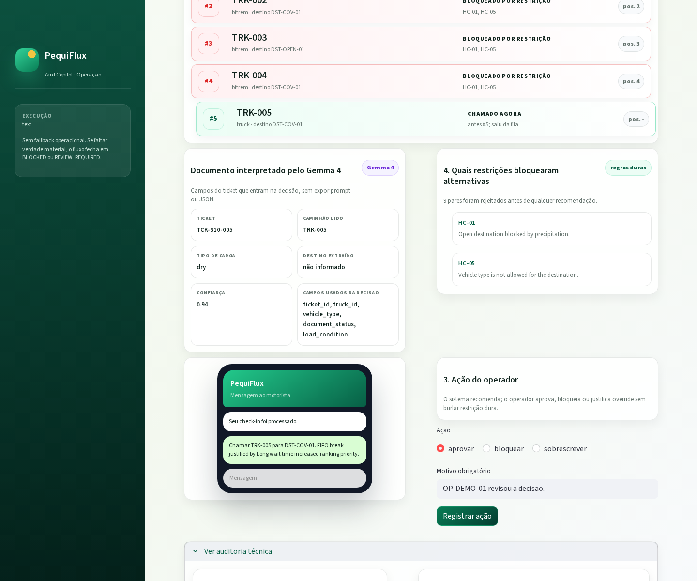

# PequiFlux Yard Copilot

[](https://github.com/PequiFlux/Pe-Q.I/actions/workflows/ci.yml)

> Copiloto multimodal, local-first e auditável para decisões de despacho de pátio.

O PequiFlux Yard Copilot decide **qual caminhão chamar** e **para qual destino despachar** quando o FIFO puro já não é suficiente. É um **working proof-of-concept técnico** — reproduzível, auditável e benchmarkável — construído para a Gemma 4 Good Hackathon.

**Princípio central:** Gemma interpreta; regras determinísticas decidem; o operador humano aprova, bloqueia ou faz override; tudo fica auditável.


## Prints da UI

| Nova decisão | Exemplo carregado |
|---|---|
|  |  |

| Resultado da análise | Auditoria técnica |
|---|---|
|  |  |

## Para avaliadores

| Em dois minutos | Onde ver |
|---|---|
| Tese | Pe-Q.I recomenda quem chamar, para qual moega, por que o FIFO puro falharia e qual regra sustenta a decisão |
| Demo executável | `make ui-text`/`make demo-text` sem GPU; `make ui`/`make demo` para Gemma/Ollama completo |
| Benchmark | `make bench` gera relatório interno em `bench/reports/extended/<run_id>/`; [`bench/reports/sample/`](bench/reports/sample/) permanece como snapshot público congelado |
| Evidência visual | [`assets/screenshots/`](assets/screenshots/) e prints acima |
| Roteiro de apresentação | [`docs/DEMO_SCRIPT.md`](docs/DEMO_SCRIPT.md) |
| Critérios e limites | [`docs/HACKATHON_SUBMISSION.md`](docs/HACKATHON_SUBMISSION.md) e [`docs/LIMITATIONS.md`](docs/LIMITATIONS.md) |

Atalhos principais:

```bash
make demo-text
make ui-text
make quality
make test
make bench
make audit
```

---

## Sumário

- [O que é](#o-que-é)
- [Quickstart](#quickstart)
- [Demo](#demo)
- [Runtime Text vs Runtime Gemma](#runtime-text-vs-runtime-gemma)
- [Benchmark](#benchmark)
- [Claims permitidos](#claims-permitidos)
- [Fluxo do sistema](#fluxo-do-sistema)
- [Hard Constraints](#hard-constraints)
- [Política de ranking](#política-de-ranking)
- [Garantia fail-closed](#garantia-fail-closed)
- [Variants de decisão](#variants-de-decisão)
- [Scenario Pack](#scenario-pack)
- [Configuração](#configuração)
- [Estrutura do projeto](#estrutura-do-projeto)
- [Testes](#testes)
- [Documentação](#documentação)
- [Evidências de submissão](#evidências-de-submissão)
- [Convenções de código](#convenções-de-código)
- [Segurança do repositório](#segurança-do-repositório)
- [Licença](#licença)

---

## O que é

Um **artefato vertical com fronteira nítida** que resolve um problema estreito e julgável:

> **Quem deve ser chamado agora, para qual destino, quando a exceção operacional quebra a legitimidade do FIFO puro.**

O copiloto recebe cinco entradas — fila CSV, ticket/documento, nota do operador, estado de clima e estado de recurso — e produz:

| Saída | Descrição |
|-------|-----------|
| Par caminhão-destino recomendado | Ou estado explícito `BLOCKED` / `REVIEW_REQUIRED` |
| Hard constraints que dispararam | Quais regras eliminaram pares inelegíveis |
| Justificativa auditável | Proveniência completa e hashes dos insumos |
| Mensagem ao motorista | 220 caracteres ou menos |
| Ação humana disponível | `approve`, `block` ou `override` (com motivo) |

O que Gemma 4 prova nesta submissão — três pontos onde um baseline heurístico resolve mal:

1. **Parsing multimodal do ticket/documento** — extrai campos estruturados de PDF/imagem com confiança
2. **Classificação da exceção** — quando documento, nota e estado precisam ser reconciliados
3. **Tools controladas** — no fluxo `full`, constraints, ranking e auditoria passam por whitelist, ordem de estados e log estruturado

`reason_summary` é gerado de forma determinística a partir da decisão formal; Gemma interpreta documentos e ajuda em classificação ambígua. O `ToolGateway` está implementado e é usado no fluxo `full` para executar `validate_hard_constraints`, `rank_candidates` e `generate_audit_payload` sob whitelist, ordem de estados, validação de IDs locais e log estruturado.

---

## Quickstart

### Pré-requisitos

- Docker e Docker Compose
- (Para GPU) NVIDIA Container Toolkit

### Build e execução mínima de um cenário

```bash
docker build -t pequiflux-yard-copilot:local .
docker run --rm pequiflux-yard-copilot:local
```

Esse caminho usa `PEQUIFLUX_GEMMA_RUNTIME=text` dentro da imagem e não requer GPU, Ollama nem serviço `gemma`.

Atalho:

```bash
make demo-text
```

Isso executa o cenário **S10_FIFO_BREAK_JUSTIFIED** com runtime textual determinístico.

### Suite de testes

```bash
docker build --target test -t pequiflux-yard-copilot:test .
docker run --rm pequiflux-yard-copilot:test
```

Atalho:

```bash
make test
```

O target `test` usa `PEQUIFLUX_GEMMA_RUNTIME=text` — não requer GPU nem Ollama.

### Streamlit UI

```bash
docker compose --profile ui-text up ui-text
```

Atalho:

```bash
make ui-text
```

Abra [http://localhost:8501](http://localhost:8501).

Para a UI completa com Ollama/Gemma, rode `make ui`; o Compose sobe `gemma`, executa `gemma-init` para puxar `${GEMMA_MODEL:-gemma4:latest}` e então inicia a UI.

### Benchmark completo com Gemma/Ollama

```bash
docker compose run --rm benchmark
```

Atalho:

```bash
make bench
```

Relatórios em `bench/reports/extended/` por padrão. O snapshot público congelado continua em `bench/reports/sample/`.

### Checklist local (Docker indisponível, emergência apenas)

```bash
PEQUIFLUX_GEMMA_RUNTIME=text pytest -q
```

---

## Demo

A demo padrão (cenário S10) demonstra o argumento central do projeto: **a quebra de FIFO é justificada por restrições operacionais**.

```bash
# Caminho minimo reprodutivel, sem GPU/Ollama
docker compose run --rm demo-text

# Cenário específico
SCENARIO=S02_RAIN_OPEN make demo-text

# Modo completo com Gemma/Ollama
docker compose run --rm demo
```

Saída esperada (JSON):

```json
{
  "request_id": "REQ-2026-0010",
  "scenario_id": "S10_FIFO_BREAK_JUSTIFIED",
  "variant": "full",
  "decision_status": "PREVIEW_READY",
  "recommended_truck": { "truck_id": "TRK-005", "queue_position_before": 5 },
  "recommended_destination": { "destination_id": "DST-COV-01" },
  "reason_summary": "FIFO break justified by Long wait time increased ranking priority.",
  "fired_rules": ["PR-01", "PR-04"],
  "rejected_count": 9,
  "hard_constraints_checked": ["HC-01", "HC-05"],
  "latency_ms": {
    "parse_ticket_document": 0,
    "validate_hard_constraints": 0,
    "rank_candidates": 0
  }
}
```

`fired_rules` lista apenas regras de política/ranking (`PR-*`). Hard constraints (`HC-*`) aparecem em `hard_constraints_checked` e nos candidatos rejeitados da matriz de validação.

---

## Runtime Text vs Runtime Gemma

O sistema oferece dois runtimes de interpretação, selecionados por `PEQUIFLUX_GEMMA_RUNTIME`:

### Runtime Gemma (`ollama`)

| Aspecto | Detalhe |
|---------|---------|
| Backend | Ollama local hospedando Gemma 4 (E4B recomendado, E2B como fail-closed de modelo) |
| Parsing | Multimodal real — PDF renderizado em imagem + texto extraído |
| Classificação de exceção | Modelo interpreta documento + nota + estado e classifica |
| `reason_summary` | Gerado de forma determinística a partir da decisão formal |
| ToolGateway | No fluxo `full`, executa `validate_hard_constraints`, `rank_candidates` e `generate_audit_payload` sob whitelist, ordem de estados, validação de IDs locais e log estruturado |
| Temperatura | `0` (determinístico na inferência) |
| Formato de saída | JSON estruturado validado contra Pydantic schema |
| Requisitos | GPU ou CPU com latência aceitável; Ollama ativo; modelo previamente puxado |

### Runtime Text (`text`)

| Aspecto | Detalhe |
|---------|---------|
| Backend | Parser determinístico puro — sem modelo, sem GPU, sem rede |
| Parsing | Regex simples sobre `ticket.txt`; fixtures multimodais de CI usam `expected_ticket.json` sidecar |
| Classificação de exceção | Retorna `MANUAL_REVIEW_HINT` com `needs_human_review=true` |
| `reason_summary` | Gerado de forma determinística a partir da decisão formal |
| ToolGateway | Intent determinístico para CI; sem Gemma/Ollama real |
| Formato de saída | `ParsedTicket` Pydantic validado normalmente |
| Requisitos | Nenhum — funciona em CI, Docker sem GPU, qualquer máquina |
| Uso principal | Testes, CI/CD, validação de contratos, debug rápido |

### Quando usar cada um

| Situação | Runtime recomendado |
|----------|-------------------|
| Demo para juízes / vídeo | `ollama` |
| CI/CD, testes automatizados | `text` |
| Desenvolvimento local sem GPU | `text` |
| Benchmark comparativo completo | `ollama` (para variante `full`) |
| Validação de regras determinísticas | `text` (variante `heuristic`) |

### Desabilitar Gemma completamente

```bash
PEQUIFLUX_GEMMA_RUNTIME=none
```

O adapter retorna `None` e o orquestrador falha fechado com `MODEL_RUNTIME_UNAVAILABLE` — nunca faz fallback.

---

## Benchmark

O benchmark executa o pack versionado atual (**20 cenários × 4 linhas comparativas**) e computa métricas comparativas. A variante operacional `fifo` continua existindo internamente, mas o relatório a nomeia como `fifo_safe` porque ela ainda passa por hard constraints.

Há dois artefatos conceitualmente distintos:

- `bench/reports/sample/`: snapshot público congelado em 20 cenários para README, CI e evidência de submissão.
- `bench/reports/extended/<run_id>/`: runs de desenvolvimento interno, livres para crescer sem inflar a página pública.
- `bench/reports/extended-sample/<run_id>/`: snapshots temporários para testar mudanças próximas do sample público sem alterar a evidência congelada.

### Variantes

| Variante | Gemma? | Comportamento |
|----------|--------|---------------|
| `full` | Sim (Ollama) | Parsing multimodal, classificação de exceção e tools determinísticas via `ToolGateway`; `reason_summary` é determinístico |
| `heuristic` | Não | Mesmo rules engine determinístico; parser de texto estruturado; explicação por template |
| `fifo_safe` | Não | FIFO entre pares elegíveis; ignora interpretação documental, mas respeita hard constraints |
| `raw_fifo` | Não | FIFO bruto por `arrival_ts` e `declared_destination`; ignora contexto e constraints |

### Métricas

| Métrica | O que mede | Alvo |
|---------|-----------|------|
| `constraint_violation_rate` | Violação de hard constraints | **0** |
| `decision_match_at_1` | Acordo top-1 com decisão esperada | > baseline |
| `exception_f1` | Macro-F1 na classificação de exceção | > baseline |
| `ticket_field_accuracy` | Acurácia campo-a-campo do ticket parseado | > baseline |
| `fifo_break_justified_precision` | Precisão de quebras de FIFO justificadas | > baseline |
| `latency_p50` / `latency_p95` | Latência de decisão (ms) em execução Ollama/Gemma local | p50 ≤ 8s, p95 ≤ 15s no hardware de referência |
| `audit_completeness` | Completude da trilha de auditoria | 100% |

`audit_completeness` é uma métrica de completude dos payloads que entram no benchmark comparativo, não um indicador universal de toda falha catastrófica. Em falhas pré-ingestão, como arquivo ausente antes de haver interpretação, hashes completos, latências e proveniência podem não existir; nesses casos a expectativa correta é falhar fechado com erro explícito, não preservar `audit_completeness = 1.0`.

### Critérios de sucesso

- `constraint_violation_rate = 0` no sistema completo
- Ganho sobre baseline heurístico em `ticket_field_accuracy`, `exception_f1` e `decision_match_at_1`
- O sample versionado precisa incluir ao menos um caso multimodal onde `heuristic` falha fechado ou perde acurácia e `full` acerta
- 100% das quebras de FIFO e overrides com trilha reconstruível
- todos os cenários versionados executam sem edição manual

### Execução

```bash
docker compose run --rm benchmark
```

Saída padrão: `bench/reports/extended/<run_id>/` com `metrics.json`, `per_scenario.json` e `summary.csv`.

### Snapshot público congelado

O snapshot versionado em `bench/reports/sample/` fica congelado em 20 cenários. Ele inclui `S03_WET_LOAD` e `S11_IMAGE_ROTATED_WET_LOAD` como tickets em `image/png`, além de `S12_PDF_SCANNED_DOCUMENT_BLOCK` como PDF escaneado sem texto extraível.
Ele é gerado com runtime textual/fixtures determinísticos para CI e mede contrato, comportamento, acurácia e separação entre variantes. As latências zeradas desse sample não representam performance real; latência deve ser lida apenas em execuções locais com Ollama/Gemma no trilho `extended`.
O CLI recusa `bench/reports/sample/` como `--output-dir`; novos testes devem usar `bench/reports/extended-sample/<run_id>` ou um diretório temporário local.

- `full`: `20/20`, `decision_match_at_1 = 1.0`, `exception_f1 = 1.0`, `ticket_field_accuracy = 0.969`, `audit_completeness = 1.0`
- `heuristic`: `decision_match_at_1 = 0.85`, `exception_f1 = 0.678`, `ticket_field_accuracy = 0.85`, `audit_completeness = 0.85`
- `fifo_safe`: `decision_match_at_1 = 0.7`, `constraint_violation_rate = 0.0`
- `raw_fifo`: `decision_match_at_1 = 0.25`, `constraint_violation_rate = 0.35`
- `S03_WET_LOAD`, `S11_IMAGE_ROTATED_WET_LOAD` e `S12_PDF_SCANNED_DOCUMENT_BLOCK`: `heuristic` fecha em `BLOCKED` por falta de texto extraível; `full` chega ao resultado esperado via sidecar multimodal de CI.

### Benchmark extended interno

Use o trilho `extended` para evoluir o scenario pack, latência real, ablações e comparativos maiores sem alterar o contrato público do sample. Use `extended-sample` apenas quando precisar comparar um snapshot de teste contra a evidência pública congelada.

```bash
make bench
```

Se precisar forçar um destino específico:

```bash
docker compose run --rm benchmark python -m app.cli.run_benchmark --manifest scenarios/manifest.json --output-dir bench/reports/extended/manual-run
```

### Setup do Gemma (necessário para `make demo` e benchmark com runtime Ollama; automático em `make ui`)

```bash
# Puxar o modelo para o volume do Ollama
docker compose --profile gemma-setup run gemma-init

# Aquecer o modelo (primeira inferência)
docker compose --profile gemma-setup run gemma-prewarm
```

---

## Claims permitidos

Estes são os únicos claims que podem ser feitos sobre esta submissão:

| Claim permitido | Evidência |
|----------------|-----------|
| "O sistema é reproduzível, auditável e benchmarkável" | Comandos Docker únicos; snapshot público em `bench/reports/sample/` e runs internas em `bench/reports/extended/`; trilha imutável em SQLite/JSONL |
| "Gemma agrega valor sobre baseline heurístico" | Benchmark comparativo com métricas `ticket_field_accuracy`, `exception_f1`, `decision_match_at_1` |
| "Nenhuma hard constraint é violada" | `constraint_violation_rate = 0` enforceado por testes unitários, failure tests e benchmark |
| "O sistema falha fechado" | `app.gemma.fallback.forbid_fallback()` sempre levanta `FallbackForbiddenError`; testes em `tests/unit/test_no_fallbacks.py` |
| "O operador humano é a autoridade final" | Ações `approve`/`block`/`override` com trilha; override inválido gera `REVIEW_REQUIRED` |
| "Todo FIFO break tem trilha auditável" | `audit_completeness = 100%` é critério de sucesso |
| "Operação local-first após setup/cache" | Docker Compose; sem dependência de cloud após pull do modelo |

### Claims **não permitidos**

| Claim proibido | Por quê |
|----------------|---------|
| "Validado em campo" | Dados e cenários são sintéticos |
| "Pronto para produção" | Sem validação operacional real |
| "Otimiza o pátio globalmente" | Escopo é despacho pontual sob exceção |
| "Fine-tuned para operação real" | Modelo é usado zero-shot com prompting contract-first |
| "Substitui o operador" | O humano aprova, bloqueia ou faz override; o sistema recomenda |
| "Precisão de X%" (valor absoluto) | Thresholds e pesos são genéricos deliberadamente (Assunção A-09) |

---

## Fluxo do sistema

```
queue.csv + ticket + nota + clima + recursos
    |
    v
[ Adapters ]         -- normaliza inputs brutos em objetos canônicos
    |
    v
[ Gemma ]            -- parsing multimodal e classificação de exceção ambígua
    |
    v
[ Truth Resolver ]   -- estado local > documento parseado > nota; conflitos = BLOCKED
    |
    v
[ Hard Constraints ] -- HC-01 a HC-07; qualquer falha = par inelegível
    |
    v
[ Ranking ]          -- scoring ponderado sobre pares elegíveis apenas
    |
    v
[ Decision Builder ] -- compõe preview, mensagem ao motorista, payload de auditoria
    |
    v
[ UI ]               -- operador vê recomendação, valida e finaliza
```

### Máquina de estados

```
RECEIVED -> NORMALIZED -> PARSED -> INTERPRETED -> VALIDATED -> RANKED -> PREVIEW_READY -> HUMAN_FINALIZED
    |          |            |           |             |           |            |
    +--------> BLOCKED <----+-----------+-------------+-----------+            |
    +--------> REVIEW_REQUIRED <-------+-------------+-----------+            |
    +--------> ERROR_TERMINAL <--------+-------------+                        |
                                                               (approve / block / override)
```

- **BLOCKED**: Evidência suficiente de que não existe despacho automático seguro.
- **REVIEW_REQUIRED**: Verdade insuficiente para automatizar; humano deve intervir.
- **ERROR_TERMINAL**: Falha de sistema apenas. Nunca fallback silencioso.

---

## Hard Constraints

| ID | Nome | Regra |
|----|------|-------|
| HC-01 | `OPEN_DESTINATION_BLOCKED_BY_RAIN` | Precipitação + exposição aberta = par inelegível |
| HC-02 | `WET_LOAD_REQUIRES_COMPATIBLE_DESTINATION` | Carga úmida exige destino compatível |
| HC-03 | `DOWN_OR_BLOCKED_RESOURCE_CANNOT_RECEIVE` | Recurso down/blocked = sem despacho |
| HC-04 | `DOCUMENT_BLOCK_PREVENTS_DISPATCH` | Documento não-clear = inelegível para auto-despacho |
| HC-05 | `VEHICLE_DESTINATION_COMPATIBILITY` | Tipo de veículo deve estar na lista permitida do destino |
| HC-06 | `MIN_OPERATIONAL_CAPACITY_REQUIRED` | Abaixo do mínimo = inelegível; entre mínimo e conforto = penalidade |
| HC-07 | `OVERRIDE_CANNOT_BYPASS_HARD_CONSTRAINTS` | Override exige motivo e só aceita pares elegíveis |

Taxa de violação deve ser **zero** em todos os cenários.

---

## Política de ranking

Perfil padrão (`v1-demo`):

| Peso | Valor | Regra | Significado |
|------|-------|-------|-------------|
| FIFO position | 40 | PR-01 | Ordem de chegada preservada quando possível |
| Contract priority | 30 | PR-02 | Caminhão contratado supera FIFO entre elegíveis |
| Resource fit | 15 | PR-06 | Destino alinhado à exceção ativa recebe bônus auditável |
| Capacity headroom | 10 | PR-03 | Capacidade reduzida penaliza |
| Wait SLA pressure | 5 | PR-04 | Espera excessiva recebe bônus limitado |
| No valid pair | - | PR-05 | Ausência de par válido gera `BLOCKED`, não improvisação |

Desempate: score maior, posição menor na fila, chegada mais cedo, ID lexicográfico.

Apenas pares **elegíveis** (passaram por todas as hard constraints) entram no ranking.

---

## Garantia fail-closed

O sistema **nunca faz fallback**:

- Sem modelo substituto, heurística degradada ou modo silencioso
- Sem retry que altere lógica de decisão
- Sem substituição automática de dependência ausente
- `app.gemma.fallback.forbid_fallback()` sempre levanta `FallbackForbiddenError`
- Teste `tests/unit/test_no_fallbacks.py` enforce em nível de teste
- Blueprint audit (`app.cli.blueprint_audit`) escaneia por frases de fallback deprecadas

Se a verdade é insuficiente, a decisão é `BLOCKED` ou `REVIEW_REQUIRED` com motivo explícito.

---

## Variants de decisão

| Variante | Gemma? | Comportamento |
|----------|--------|---------------|
| `full` | Sim (Ollama) | Parsing multimodal, classificação de exceção e tools determinísticas via `ToolGateway`; `reason_summary` é determinístico |
| `heuristic` | Não | Rules engine determinístico; parser de texto; templates de explicação |
| `fifo` | Não | Variante operacional FIFO segura: preserva fila entre pares elegíveis e ainda respeita hard constraints |

No relatório de benchmark, essa variante aparece como `fifo_safe`. A linha `raw_fifo` é calculada separadamente a partir da fila bruta para manter a comparação pública de FIFO puro fora da tela operacional principal.

Seleção por `PEQUIFLUX_GEMMA_RUNTIME`:

| Valor | Efeito |
|-------|--------|
| `ollama` | Ollama local com Gemma 4 |
| `text` | Parser determinístico (CI/testes) |
| `none` / `disabled` | Sem runtime Gemma — falha fechado |

---

## Scenario Pack

O pack principal tem 20 cenários sintéticos em `scenarios/cases/` e está congelado como vitrine pública. Próximos casos devem ir para `scenarios/extended/stress/` ou `scenarios/extended/failure/`, não para o manifest principal.

Catálogo humano canônico:
- [`scenarios/README.md`](scenarios/README.md)

Contrato estrutural e critérios de integridade:
- [`docs/scenario-pack.md`](docs/scenario-pack.md)

Para leitura rápida na página pública, os grupos principais são:
- Base operacional e narrativa principal: `S01`-`S10`, com destaque para `S10_FIFO_BREAK_JUSTIFIED`
- Robustez multimodal: `S03`, `S11`, `S12`
- Conflitos de verdade e fail-closed: `S13`-`S16`
- Governança, desempate e stress: `S17`-`S20`

---

## Configuração

Toda configuração é por variáveis de ambiente Docker Compose ou inputs explícitos de runtime. **Nenhum `.env` é comitado.**

Exemplo sem secrets: [`config/env.example`](config/env.example). O repositório evita `.env.example` na raiz porque a política local bloqueia qualquer `.env.*` no diretório principal.

| Variável | Default | Propósito |
|----------|---------|-----------|
| `PEQUIFLUX_GEMMA_RUNTIME` | `ollama` no código; `text` na imagem Docker standalone | Backend Gemma: `ollama`, `text` ou `none` |
| `GEMMA_BASE_URL` | `http://gemma:11434` | Endpoint da API Ollama |
| `GEMMA_MODEL` | `gemma4:latest` | Identificador do modelo no Ollama |
| `GEMMA_TIMEOUT_SECONDS` | `45` | Timeout para chamadas Gemma |
| `OLLAMA_IMAGE` | `ollama/ollama:latest` | Imagem Docker do Ollama (variante GPU para aceleração) |
| `OLLAMA_KEEP_ALIVE` | `24h` | Keep-alive do modelo no Ollama |
| `PEQUIFLUX_IN_CONTAINER` | `0` | Setado para `1` pelo Dockerfile |
| `PEQUIFLUX_SQLITE_PATH` | `var/db/pequiflux_ui.db` | Caminho do banco SQLite |

`make demo-text` e `make ui-text` não sobem o serviço `gemma` e não exigem GPU. Para o modo completo, set `OLLAMA_IMAGE` para a variante desejada e instale o NVIDIA Container Toolkit se usar GPU.

---

## Estrutura do projeto

```
.
├── app/                      # Código-fonte runtime
│   ├── adapters/             # Ingestão de CSV, documento, nota, estado
│   ├── audit/                # Construção de payload auditável
│   ├── cli/                  # Entrypoints CLI (run_scenario, run_benchmark, prewarm_gemma)
│   ├── domain/               # Modelos, enums, constraints, ranking, policy
│   ├── gemma/                # Adapter, prompts, schemas, tool gateway, runtime factory
│   ├── orchestration/        # Orchestrator, state machine, truth resolver
│   ├── services/             # Parsing, classificação de exceção, decision builder, driver message
│   ├── storage/              # SQLite store, JSONL logger
│   └── ui/                   # Streamlit application
├── bench/                    # Benchmark runner e métricas
├── data/                     # Diretório de dados runtime
├── docs/                     # Documentação modular
├── scenarios/                # Fixtures sintéticas de benchmark
│   ├── cases/                # Diretórios S01–S20 da vitrine pública congelada
│   ├── common/               # Policy profile e catálogo de destinos
│   ├── extended/             # Casos futuros fora do sample principal
│   ├── manifest.json         # Payloads completos do pack de cenários
│   └── schemas/              # JSON schemas dos contratos
├── scripts/                  # Shell scripts (bootstrap, demo, benchmark, prepublish)
├── tests/                    # Suite de testes
│   ├── unit/                 # Testes unitários determinísticos
│   ├── contract/             # Testes de contrato de API/payload
│   ├── golden/               # Testes de output golden
│   ├── integration/          # Testes de integração cross-módulo
│   ├── scenarios/            # Validação e2e do scenario pack
│   ├── e2e/                  # Testes end-to-end completos
│   └── failure/              # Testes de caminho de falha (fail-closed)
├── technical_blueprint.md    # Blueprint técnico canônico (3.100+ linhas)
├── compose.yaml              # Serviços Docker Compose e profiles
├── Dockerfile                # Build multi-stage (wheels -> runtime -> test -> ui)
├── pyproject.toml            # Metadados do projeto e configuração pytest
├── requirements.txt          # Core: pydantic, PyMuPDF
├── requirements-dev.txt      # Dev: +pytest
├── requirements-ui.txt       # UI: +streamlit
├── requirements-all.txt      # Todas as dependências
└── AGENTS.md                 # Diretrizes do repositório para agentes de IA
```

---

## Testes

```bash
# Suite completa (Docker)
docker build --target test -t pequiflux-yard-copilot:test .
docker run --rm pequiflux-yard-copilot:test

# Quick check local (emergência, Docker indisponível)
PEQUIFLUX_GEMMA_RUNTIME=text pytest -q
```

| Diretório | Propósito |
|-----------|-----------|
| `tests/unit/` | Testes unitários determinísticos por módulo |
| `tests/contract/` | Contratos de API e payload |
| `tests/golden/` | Comparação de output golden |
| `tests/integration/` | Integração cross-módulo |
| `tests/scenarios/` | Validação e2e do scenario pack |
| `tests/e2e/` | Fluxo completo end-to-end |
| `tests/failure/` | Caminhos de falha — sistema deve parar ou retornar estado explícito |

Toda hard constraint tem pelo menos um teste determinístico. Testes de falha confirmam que o sistema para ou retorna `REVIEW_REQUIRED`/`BLOCKED` — nunca faz fallback.

---

## Documentação

A pasta `docs/` contém documentação modular de implementação. Em caso de conflito técnico, `technical_blueprint.md` da raiz é canônico; docs modulares detalham a implementação corrente.

| Documento | Conteúdo |
|-----------|----------|
| [`docs/product.md`](docs/product.md) | Tese, problema, escopo e critérios de sucesso |
| [`docs/decision-policy.md`](docs/decision-policy.md) | Constraints, ranking, verdade, semântica de decisão |
| [`docs/architecture.md`](docs/architecture.md) | Módulos, fluxo, máquina de estados, persistência |
| [`docs/gemma.md`](docs/gemma.md) | Papel do Gemma, prompting contract-first, ToolGateway |
| [`docs/contracts.md`](docs/contracts.md) | Payloads e contratos de função |
| [`docs/scenario-pack.md`](docs/scenario-pack.md) | Estrutura dos cenários, benchmark e relatórios |
| [`docs/docker.md`](docs/docker.md) | Uso Docker/Compose, variáveis, GPU |
| [`docs/public-repo.md`](docs/public-repo.md) | Sanitização e checklist de publicação |
| [`docs/DEMO_SCRIPT.md`](docs/DEMO_SCRIPT.md) | Roteiro de vídeo/demo de 3 minutos |
| [`docs/HACKATHON_SUBMISSION.md`](docs/HACKATHON_SUBMISSION.md) | Critérios da hackathon mapeados para evidências do repo |
| [`docs/LIMITATIONS.md`](docs/LIMITATIONS.md) | Limites explícitos do protótipo |
| [`docs/UI_DECISIONS.md`](docs/UI_DECISIONS.md) | Decisões de interface para operador, FIFO e auditoria |
| [`docs/CODEMAP.md`](docs/CODEMAP.md) | Mapa vivo dos módulos |
| [`docs/SURFACE_MAP.md`](docs/SURFACE_MAP.md) | Contratos públicos/exportados |
| [`docs/DUPLICATION_GUARD.md`](docs/DUPLICATION_GUARD.md) | Pontos de reutilização e anti-duplicação |
| [`docs/SETUP_STATUS.md`](docs/SETUP_STATUS.md) | Estado de setup, checks e comandos disponíveis |
| [`technical_blueprint.md`](technical_blueprint.md) | Blueprint técnico canônico |
| [`docs/technical_blueprint.md`](docs/technical_blueprint.md) | Ponte curta para a fonte canônica da raiz |

---

## Evidências de submissão

| Evidência | Caminho |
|---|---|
| Screenshot final da interface | [`assets/screenshots/pequiflux-ui.png`](assets/screenshots/pequiflux-ui.png) |
| Fluxo visual da UI | [`assets/screenshots/pequiflux-ui-01-initial.png`](assets/screenshots/pequiflux-ui-01-initial.png), [`assets/screenshots/pequiflux-ui-02-example-loaded.png`](assets/screenshots/pequiflux-ui-02-example-loaded.png), [`assets/screenshots/pequiflux-ui-03-result.png`](assets/screenshots/pequiflux-ui-03-result.png), [`assets/screenshots/pequiflux-ui-04-audit-expanded.png`](assets/screenshots/pequiflux-ui-04-audit-expanded.png) |
| Relatório sample do benchmark | [`bench/reports/sample/`](bench/reports/sample/) |
| Relatórios extended internos | `bench/reports/extended/<run_id>/` |
| Roteiro de demo | [`docs/DEMO_SCRIPT.md`](docs/DEMO_SCRIPT.md) |
| Mapa da submissão | [`docs/HACKATHON_SUBMISSION.md`](docs/HACKATHON_SUBMISSION.md) |

---

## Convenções de código

- **Python 3.11**, type-annotated, indentação de 4 espaços
- Funções: `snake_case`; Classes/Pydantic: `PascalCase`; Constantes: `UPPER_SNAKE_CASE`
- IDs de regras exatamente como no blueprint (ex.: `HC_01_OPEN_DESTINATION_BLOCKED_BY_RAIN`)
- Formatação: `black`; Ordenação de imports: `isort`
- Commits: [Conventional Commits](https://www.conventionalcommits.org/) (`feat:`, `fix:`, `docs:`, `test:`)

---

## Segurança do repositório

- **Todos os dados são sintéticos.** Sem dados reais, credenciais ou identificadores de operadores.
- IDs placeholder apenas (ex.: `OP-DEMO-01`).
- Thresholds, pesos e cenários alinhados com assunções sanitizadas do blueprint.
- Nenhum `.env`, `.env.*` ou `.venv/` no repositório.
- Configuração via Docker, Compose, placeholders documentados ou inputs explícitos de runtime — nunca secrets comitados.
- Script `scripts/prepublish_check.sh` verifica essas restrições antes de qualquer release.

---

## Licença

MIT. Consulte [`LICENSE`](LICENSE).
